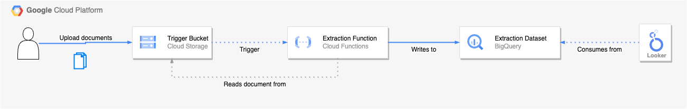

# TODO

- [ ] Update Looker component
- [ ] Enhance more generic examples (Finance/Insurance/Etc)

# WIP Solution

This is a WIP showcasing data extraction from unstructured documents using Vertex AI, BigQuery, and Looker.

# Description

The solution allows a user to upload unstructured PDF files via a Frontend and have the extracted information ultimately displayed in a dashboard for consumption. As opposed to manually skimming and extracting the information from page-long, unstructered documents, the LLM acts inbetween and extracts the required information as per the instructions.

The LLM is utilized for and does exactly what its great at, **generate content**, and Looker is being used to display the relevant information to act upon.

The solution includes:

- Example Frontend, realized using Streamlit for demonstrative purposes
- Cloud Storage, Googles solution to storing unstructured data
- Cloud Functions, Googles serverless solution to run code
- BigQuery, a fully managed, AI-ready data analytics platform
- Looker an enterprise platform for BI, data applications, and embedded analytics that helps you explore and share insights in real time

## Setup

Getting started involves:

- Cloud Function settings/extraction instructions to be set [following these instructions](./wip-cloud-function/README.md)
- Backend Setup - setup the GCP backend of storage, bigquery, and cloud functions [using these instructions](./wip-backend/README.md)
- Frontend Setup - setup the example Streamlit frontend [using these instructions](./wip-frontend/README.md)
- Looker Setup - create model and view for consumption of data [using these instructions](./wip-looker/README.md) (**THIS IS OUT OF DATE**)

## Instructions/How-to

After everything is set up following the setup instructions above:

- Open up the frontend in browser
- During backend deployment, the output is showing a trigger bucket - copy this and enter into the frontend to check if bucket exists
- Upload file for data extraction
- Open up Looker, select your explore - et voila, new data appears

## Architecture

