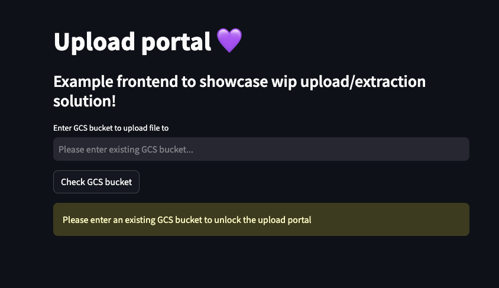

# WIP Solution Frontend

## Overview

The provided frontend is an exemplary poc, just to showcase the flow of the entire solution.

## Prerequisites

Install the required python libraries

```bash
pip install google-cloud-storage streamlit
```

## Requirements

- You have an active `gcloud config` and are authenticated

## Config and deployment

These instructions are assuming that the frontend is run locally.

- If not already, navigate to the `wip-frontend` folder (ie. `cd wip-frontend`) from the root folder.
- Spin up the frontend `streamlit run wip_frontend.py`
- The terminal will output the URL of the frontend

## Use

- [Follow main instructions](../README.md) on using the solution


